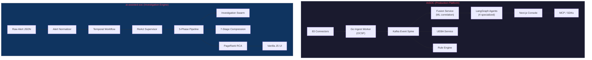

# Deep Comparison: AiSOC vs ai-assisted-soc

## 1. What Each Project Is

### AiSOC (`D:\projects\AiSOC`)

A **production-grade, open-source AI Security Operations Center** — a full-stack, multi-service monorepo designed for real-world deployment. Think of it as an **open-source Splunk + CrowdStrike AI + SOAR combined**, MIT-licensed and self-hostable.

**Uses:**
- **Enterprise SOC platform** — ingests real security telemetry from 83 vendor connectors (CrowdStrike, Splunk, Azure, AWS, GCP, Okta, etc.), normalizes to OCSF, detects threats, and surfaces results in a SOC console
- **AI-driven investigation** — LangGraph-based agents (DetectAgent → TriageAgent → HuntAgent → RespondAgent) autonomously investigate security incidents
- **Detection-as-Code** — 947 executable detection rules with CI-gated fixtures
- **Hunt workbench** — natural-language to ES|QL / SPL / KQL translation
- **SOAR** — governed automated response with confidence × blast-radius × reversibility policy
- **MCP server** — IDE/chat integration for analysts via Claude, Cursor, Cody
- **Marketplace** — plugin ecosystem (Python / TypeScript / Go SDKs)
- **Public demo** — deployed at tryaisoc.com on Fly.io

**Tech Stack:**
| Layer | Technology |
|-------|-----------|
| Frontend | Next.js (apps/web), React |
| API | FastAPI (Python), Uvicorn |
| Event spine | Apache Kafka |
| Storage | PostgreSQL, ClickHouse, OpenSearch, Neo4j, Qdrant, Redis |
| Agents | LangGraph (~600-line orchestrator) |
| Ingest | Go worker (OCSF normalization) |
| Infra | Docker Compose, Terraform, Helm, Fly.io, Render |
| Monorepo | pnpm + Turborepo |

**Scale:** 19 backend services, 14 packages, ~83 connectors, ~7,000 detection rules (947 executable), 380+ tests, 46 CI-gated product claims, 19 GitHub Actions workflows.

---

### ai-assisted-soc (`D:\projects\ai-assisted-soc`)

A **research/prototype AI-native SOC investigation pipeline** — a single-repo Python backend + vanilla-JS frontend focused on deep agentic investigation of individual alerts. Think of it as an **AI investigation engine prototype** that demonstrates how autonomous agents should reason about security incidents.

**Uses:**
- **Deep agentic investigation** — a 5-phase pipeline (Triage → Evidence → Compression → RCA → Response) that autonomously investigates a single alert end-to-end
- **ReAct Supervisor** — an LLM-driven supervisor that dynamically decides next investigation steps
- **Investigation Swarm** — parallel competing-hypothesis generation for complex cases
- **Root Cause Analysis** — NetworkX-based causal graph with PageRank scoring
- **7-Stage Noise Compression** — reduces raw events by 1000–10,000× through temporal filtering, entity correlation, behavioral filtering, dedup, graph analysis, abstraction, and risk scoring
- **Self-Play Purple Team** — auto-generates synthetic attack campaigns, replays through the detection engine, measures coverage, proposes new rules
- **Compounding Memory** — cross-investigation knowledge distillation
- **Temporal Workflows** — durable workflow orchestration via Temporal.io
- **Local LLM support** — designed around LM Studio / local models

**Tech Stack:**
| Layer | Technology |
|-------|-----------|
| Frontend | Vanilla JS + HTML + CSS (3 files) |
| API | FastAPI (Python) |
| Orchestration | Temporal.io (durable workflows) |
| Storage | PostgreSQL, Neo4j, Redis, FAISS (vector store) |
| Agents | LangChain, Pydantic structured output |
| LLM | LM Studio (local), OpenAI-compatible |
| RAG | FAISS + HuggingFace sentence-transformers |
| Graph analysis | NetworkX |

**Scale:** ~30 service modules, ~380 backend tests, 3 frontend files, extensive documentation (40K+ architecture doc, 30K+ API doc).

---

## 2. Key Architectural Differences



| Dimension | AiSOC | ai-assisted-soc |
|-----------|-------|-----------------|
| **Architecture** | Distributed microservices monorepo | Monolithic single-app |
| **Scope** | Full SIEM + SOAR + AI SOC platform | AI investigation engine only |
| **Agent framework** | LangGraph (graph-based orchestrator) | LangChain + custom ReAct supervisor |
| **Agent design** | 4 specialized agents (Detect/Triage/Hunt/Respond) with scored planner routing | 6 sub-agents (Triage/Evidence/NetworkDiscovery/Compression/RCA/Response) with ReAct supervisor |
| **Workflow durability** | None (in-process) | Temporal.io (durable, resumable) |
| **Event ingestion** | Go worker → Kafka → ClickHouse (production-scale) | Python in-memory + PostgreSQL |
| **Detection** | 947 rules + Sigma/YARA/KQL + stateful detections | YAML Detection-as-Code engine (smaller corpus) |
| **Connectors** | 83 production connectors with vault-encrypted secrets | CrowdStrike + Splunk normalizers (2) |
| **Frontend** | Full Next.js SPA with Investigation Rail, Hunt workbench, Marketplace | 3-file vanilla JS SPA |
| **RAG** | Qdrant vector store | FAISS in-memory vectorstore |
| **Evidence collection** | Real tool calls (IOC enrichment, MITRE lookup, graph blast-radius) | Skill-based dispatchers with log ingestor (file-based) |
| **Investigation reasoning** | Fuse-time narrative + scored planner | ReAct loop + Investigation Swarm + Compounding Memory |
| **RCA** | Narrative projection from fusion | NetworkX causal graph + PageRank |
| **Noise reduction** | Fusion service ML correlation | 7-stage compression engine (1000–10,000× reduction) |
| **Security hardening** | 12-phase hardening program, CodeQL CI gate, PromptInjectionGuard | OWASP Top 10 for Agentic AI (ASI01/ASI02/ASI06) |
| **LLM routing** | Cost cascade (cheap model first → strong on low confidence), per-tenant budgets | Deterministic → ML → LLM escalation ladder |
| **Memory** | Redis-based, no cross-investigation memory | Compounding Memory (knowledge distillation across investigations) |
| **Testing** | Eval harness (5 CI-gated suites), e2e, compose-smoke | 380 pytest unit tests |
| **Deployment** | Fly.io, Render, Docker Compose, K8s, Terraform | Docker Compose only |
| **Maturity** | v7.7.0 "Fully-Operational" release | Waves 0-3 complete, Wave 4 paused |

---

## 3. What to Add FROM `ai-assisted-soc` TO `AiSOC`

These are capabilities in `ai-assisted-soc` that are either absent or weaker in AiSOC and would make it significantly better:

### 🔴 High Impact

#### 3.1 ReAct Supervisor Loop
**What it is:** An LLM-driven autonomous supervisor ([supervisor.py](file:///D:/projects/ai-assisted-soc/backend/services/supervisor.py)) that observes the investigation blackboard, reasons about forensic gaps, and dynamically selects the next action — rather than a static pipeline.

**Why AiSOC needs it:** AiSOC's LangGraph orchestrator uses a scored planner to route alerts to agents, but it follows a relatively fixed funnel (Detect → Triage → Hunt → Respond). The ReAct supervisor pattern would allow the investigation to dynamically pivot when new evidence changes the picture, request re-investigation of specific entities, and terminate investigations early when sufficient confidence is reached.

**Effort:** Medium — integrate into `services/agents/app/orchestrator/`

---

#### 3.2 Investigation Swarm (Competing Hypotheses)
**What it is:** [hypothesis_swarm.py](file:///D:/projects/ai-assisted-soc/backend/services/hypothesis_swarm.py) — generates 3-5 competing root-cause hypotheses in parallel, scores each against evidence, and a debate step picks a winner.

**Why AiSOC needs it:** AiSOC's agent funnel is single-hypothesis. For complex incidents (APT campaigns, multi-vector attacks), the swarm approach produces better root-cause analysis by exploring multiple explanations simultaneously and selecting the one with the best evidence support.

**Effort:** Medium — new module under `services/agents/app/swarm/`

---

#### 3.3 7-Stage Noise Compression Engine
**What it is:** [correlation_engine.py](file:///D:/projects/ai-assisted-soc/backend/services/correlation_engine.py) — a 7-stage pipeline (Temporal Filter → Entity Correlator → Behavioral Filter → Dedup → Graph Analysis → Abstraction → Risk Scoring) that reduces 10,000+ raw events to ~10 critical ones.

**Why AiSOC needs it:** AiSOC's fusion service does ML-based correlation, but the 7-stage approach provides transparent, explainable, stage-by-stage reduction with metrics at each stage. It's especially valuable for the Investigation Rail's timeline view — presenting a compressed, analyst-readable timeline rather than drowning them in raw events.

**Effort:** Medium-High — integrate into `services/fusion/` or as a new `services/compression/`

---

#### 3.4 NetworkX Causal Graph + PageRank RCA
**What it is:** [rca_engine.py](file:///D:/projects/ai-assisted-soc/backend/services/rca_engine.py) + [sx_truerca/causal_analyzer.py](file:///D:/projects/ai-assisted-soc/backend/services/sx_truerca/causal_analyzer.py) — builds a NetworkX causal graph from entities/events and uses PageRank to identify the root cause service/entity.

**Why AiSOC needs it:** AiSOC's narrative projection and fusion provide correlation narratives, but they lack a formal causal graph with PageRank-based root cause identification. This would give the Investigation Rail a concrete, graph-backed "this entity is the root cause because it has the highest causal centrality" determination rather than purely LLM-generated narratives.

**Effort:** Medium — integrate into `services/agents/app/graph/`

---

#### 3.5 Temporal.io Durable Workflow Orchestration
**What it is:** [temporal_workflows.py](file:///D:/projects/ai-assisted-soc/backend/services/temporal_workflows.py) + [temporal_worker.py](file:///D:/projects/ai-assisted-soc/backend/services/temporal_worker.py) — wraps the investigation pipeline in Temporal workflows, providing durability, resumability, and queryable progress.

**Why AiSOC needs it:** AiSOC's agent investigations currently run in-process. If the agent service crashes mid-investigation, the work is lost. Temporal provides: (1) durable workflow state that survives crashes, (2) resumable investigations, (3) queryable progress from the UI, (4) built-in retry and timeout policies, (5) HITL approval gates where investigations can pause for human approval.

**Effort:** High — requires adding Temporal infrastructure + wrapping agent graph in workflow activities

---

#### 3.6 Compounding Memory (Cross-Investigation Knowledge)
**What it is:** [memory/distillation.py](file:///D:/projects/ai-assisted-soc/backend/services/memory/distillation.py) — knowledge distillation across investigations so the system remembers that "this attacker hit this host before" or "this IP was the C2 in last month's incident."

**Why AiSOC needs it:** AiSOC starts each investigation from zero. Compounding memory would allow the system to: (1) recognize recurring attackers, (2) accelerate triage of similar incidents, (3) build institutional knowledge over time, (4) flag "this is the third time this user has triggered this alert" automatically.

**Effort:** Medium — new module under `services/agents/app/memory/`

---

### 🟡 Medium Impact

#### 3.7 Entity-Risk Tracker with Auto-Promotion
**What it is:** [entity_risk.py](file:///D:/projects/ai-assisted-soc/backend/services/entity_risk.py) — tracks time-decayed cumulative risk per entity across alerts; auto-promotes entities to full investigation when cumulative risk crosses a threshold.

**Why AiSOC needs it:** AiSOC's UEBA service provides baselines, but there's no explicit entity-level cumulative risk tracking with time decay. An entity with five sub-critical alerts in an hour should be auto-escalated — this module provides exactly that signal.

---

#### 3.8 Self-Play Purple Team
**What it is:** [self_play/purple_team.py](file:///D:/projects/ai-assisted-soc/backend/services/self_play/purple_team.py) — replays canned attack technique sequences through the detection engine, measures coverage, and auto-generates draft detection rules for uncaught techniques.

**Why AiSOC needs it:** AiSOC has 947 detection rules and eval harnesses, but no automated "red-team the detection corpus" capability. The purple team module would automatically find detection gaps and propose new rules — a force-multiplier for detection engineering.

---

#### 3.9 Deterministic → ML → LLM Escalation Ladder (Model Router)
**What it is:** [model_router.py](file:///D:/projects/ai-assisted-soc/backend/services/model_router.py) — checks local threat-intel feeds first (deterministic, free), then ML models, then LLM. Only escalates when lower tiers can't answer.

**Why AiSOC needs it:** AiSOC has cost-governed LLM routing with a cheap-first cascade, but the ai-assisted-soc model router adds a *deterministic* tier that bypasses LLMs entirely for known indicators (ransomware extensions, known-bad hashes). This saves LLM costs and gives instant, reproducible answers for known threats.

---

#### 3.10 Local Threat-Intel Grounding Database
**What it is:** [threat_intel/local_feeds.py](file:///D:/projects/ai-assisted-soc/backend/services/threat_intel/local_feeds.py) — curated offline threat-intel feeds (ransomware extensions, ransomware notes, suspicious ports, suspicious mutexes) loaded into in-memory SQLite for instant lookups.

**Why AiSOC needs it:** AiSOC's enrichment service does IOC lookups via external APIs. The local feeds provide a zero-latency, zero-cost baseline that catches obvious known-bad indicators before any network call.

---

#### 3.11 Skill-Based Evidence Collection with Log Ingestor
**What it is:** A rich skill-based dispatch system where entity types map to specific investigation skills (host → edr-process-tree + persistence-auditor; ip → threat-intel-lookup + network-flow-analyzer; user → identity-ad-lookup; file → file-forensics). Plus a universal log ingestor that auto-discovers and parses heterogeneous log formats (Wazuh JSON, Suricata, audit.log, auth.log, syslog).

**Why AiSOC needs it:** AiSOC's agents call tools, but the evidence skill dispatch is more granular — each entity type gets specific, targeted forensic skills rather than a generic toolbox.

---

#### 3.12 OWASP Agentic Security: Goal-Drift Detection & Tool-Call Authorization
**What it is:** [agentic_security.py](file:///D:/projects/ai-assisted-soc/backend/services/agentic_security.py) — implements three OWASP Top 10 for Agentic AI patterns: (1) `wrap_untrusted()` tags attacker-controlled data, (2) `detect_goal_drift()` catches when the supervisor proposes actions inconsistent with evidence, (3) skill authorization boundary.

**Why AiSOC needs it:** AiSOC has a PromptInjectionGuard and LLM safety module, but the goal-drift detection (flagging "supervisor wants to finalize_response with only 0.3 RCA confidence") is a novel safety layer AiSOC doesn't have.

---

### 🟢 Nice-to-Have

#### 3.13 Investigation Blackboard Pattern
**What it is:** [investigation_context.py](file:///D:/projects/ai-assisted-soc/backend/services/investigation_context.py) — a shared blackboard with typed inter-agent messages (REQUEST_EVIDENCE, LOW_CONFIDENCE, NEW_ENTITY, CHALLENGE).

**Why AiSOC might want it:** AiSOC's agents communicate through the LangGraph state, but the explicit message-passing blackboard pattern enables richer inter-agent communication (e.g., RCA agent asking Evidence agent for more data).

---

#### 3.14 Network Discovery Agent
**What it is:** Parallel agent that probes IP entities for reachability (ICMP ping, TCP port scan, DNS, traceroute) during evidence collection.

**Why AiSOC might want it:** Adds live network reconnaissance capability to investigations.

---

## 4. What to Add FROM `AiSOC` TO `ai-assisted-soc`

These are capabilities in AiSOC that would dramatically improve `ai-assisted-soc`:

### 🔴 High Impact

#### 4.1 Full Next.js Frontend (Replace Vanilla JS)
**What it is:** A complete Next.js SPA with Investigation Rail, Alerts Queue, Hunt Workbench, Marketplace, Cases view, playbook editor, SOAR studio, dark/light theme, WCAG AA accessibility.

**Why ai-assisted-soc needs it:** The current frontend is 3 vanilla JS files — unmaintainable and lacking critical SOC workflows. AiSOC's frontend is a production-grade analyst workspace.

---

#### 4.2 83 Production Data Connectors
**What it is:** 83 click-and-connect connectors ([services/connectors/app/connectors/](file:///D:/projects/AiSOC/services/connectors/app/connectors/)) for EDR, SIEM, NDR, cloud, CNAPP, identity, SaaS, VCS, K8s audit, network — with schema-driven config, live `Test connection`, vault-encrypted secrets, and APScheduler polling.

**Why ai-assisted-soc needs it:** ai-assisted-soc only has CrowdStrike + Splunk normalizers. Without connectors, it can't ingest real telemetry data. This is the single biggest missing piece for production use.

---

#### 4.3 Kafka Event Spine + ClickHouse Lake
**What it is:** Apache Kafka as the event bus between all services, with ClickHouse as the columnar event lake for fast analytical queries.

**Why ai-assisted-soc needs it:** ai-assisted-soc processes events in-memory with no durable event spine. Kafka provides: (1) decoupled producers/consumers, (2) event replay, (3) horizontal scaling. ClickHouse provides: (1) fast analytical queries over billions of events, (2) retention policies, (3) the "Advanced Data Explorer" surface.

---

#### 4.4 OCSF-Normalized Ingest Service (Go)
**What it is:** A Go-based ingest worker ([services/ingest/](file:///D:/projects/AiSOC/services/ingest/)) that normalizes all incoming events to the Open Cybersecurity Schema Framework (OCSF) standard, plus inline Neo4j entity graph writes.

**Why ai-assisted-soc needs it:** ai-assisted-soc normalizes alerts in Python but not to a standard schema. OCSF normalization enables cross-vendor correlation and interoperability.

---

#### 4.5 Production Detection Corpus (947 Rules)
**What it is:** 947 executable detection rules ([detections/](file:///D:/projects/AiSOC/detections/)) across cloud, endpoint, identity, network, application categories — with Sigma imports, Splunk imports, Chronicle imports, positive/negative fixtures, and CI-gated validation.

**Why ai-assisted-soc needs it:** ai-assisted-soc has a Detection-as-Code engine but a small hand-authored corpus. AiSOC's 947-rule corpus would massively expand detection coverage.

---

#### 4.6 Investigation Ledger + Replayable Permalinks
**What it is:** Every LLM prompt, tool call, evidence chip, and rationale stored against a case, replayable in the UI, shareable as redacted public permalinks.

**Why ai-assisted-soc needs it:** ai-assisted-soc has an investigation ledger module, but AiSOC's is production-hardened, UI-integrated, and supports public replay links — crucial for SOC teams to review and learn from past investigations.

---

#### 4.7 UEBA Service
**What it is:** A standalone UEBA (User and Entity Behavior Analytics) service ([services/ueba/](file:///D:/projects/AiSOC/services/ueba/)) with baseline profiling.

**Why ai-assisted-soc needs it:** ai-assisted-soc has entity-risk tracking but no behavioral baselines. UEBA provides "this user normally logs in from New York, this login is from Russia" signals.

---

#### 4.8 CI/CD Pipeline + Eval Harness
**What it is:** 19 GitHub Actions workflows including: CI, CodeQL, compose-smoke, e2e, detection validation, playbook validation, weekly eval benchmark, devcontainer build. Plus a 5-suite eval harness gating every PR.

**Why ai-assisted-soc needs it:** ai-assisted-soc has zero CI/CD. AiSOC's pipeline provides: (1) automated testing on every PR, (2) detection validation, (3) security scanning, (4) reproducible benchmarks.

---

#### 4.9 MCP Server for IDE Integration
**What it is:** An MCP server ([services/mcp/](file:///D:/projects/AiSOC/services/mcp/)) exposing 13 tools for Claude, Cursor, and Cody integration — analysts can query alerts, run investigations, replay ledger steps without leaving their IDE.

**Why ai-assisted-soc needs it:** Novel analyst interface that meets analysts where they work (IDE/chat).

---

### 🟡 Medium Impact

#### 4.10 Credential Vault (Fernet AES-128-CBC + MultiFernet Rotation)
Vault-encrypted connector secrets with key rotation support.

#### 4.11 Governed Response with Autonomy Policy
Confidence × blast-radius × reversibility policy for auto-execution, with rollback + post-action verification.

#### 4.12 Cost-Governed LLM Routing
Per-tenant budgets, circuit breaker, token/cost telemetry, content-addressed response cache, multi-model gateway fallbacks, BYOK keys.

#### 4.13 Hunt-as-Code
YAML hypotheses with MITRE tags, cron schedules, and federated search across Splunk SPL / Sentinel KQL / Elastic ES|QL / QRadar AQL.

#### 4.14 Marketplace + Plugin SDK
Plugin ecosystem with Python/TypeScript/Go SDKs, one-click tenant install.

#### 4.15 Docker Compose + Kubernetes + Terraform Infrastructure
Production deployment manifests for multiple targets.

#### 4.16 osquery-TLS + Honeytokens + Purple Team Services
Endpoint telemetry, deception technology, and offensive security services.

---

## 5. Summary: Complementary Strengths

```
┌─────────────────────────────────────────────────────────────────────┐
│                    ai-assisted-soc EXCELS AT                       │
│                                                                     │
│  • Deep investigation reasoning (ReAct + Swarm + Compounding)      │
│  • Noise compression (7-stage, 10,000× reduction)                  │
│  • Causal graph RCA (NetworkX + PageRank)                          │
│  • Durable workflows (Temporal.io)                                  │
│  • Local-first AI (LM Studio, FAISS, offline threat-intel)         │
│  • Agentic security (goal-drift detection, tool authorization)     │
│  • Self-play purple teaming (auto-test detection coverage)         │
│  • Entity-risk tracking with time-decay auto-promotion             │
│  • Algorithm documentation (formal pseudocode + complexity)        │
└─────────────────────────────────────────────────────────────────────┘

┌─────────────────────────────────────────────────────────────────────┐
│                      AiSOC EXCELS AT                                │
│                                                                     │
│  • Production-scale architecture (Kafka + ClickHouse + 19 services)│
│  • Data ingestion (83 connectors, OCSF normalization)              │
│  • Detection coverage (947 rules, Sigma/YARA/KQL/stateful)        │
│  • Frontend/UX (full Next.js SOC console)                          │
│  • CI/CD + eval harness (19 workflows, 5 eval suites)             │
│  • Plugin ecosystem (SDKs, marketplace, MCP)                       │
│  • Infrastructure (Docker, K8s, Terraform, Fly.io, Render)        │
│  • Security hardening (12-phase program, CodeQL CI gate)           │
│  • Multi-tenancy + enterprise features (RBAC, BYOK, audit)        │
│  • Open-source governance (MIT, CONTRIBUTING, SECURITY)            │
└─────────────────────────────────────────────────────────────────────┘
```

> [!IMPORTANT]
> **The ideal combination** would be AiSOC's production platform serving as the deployment surface, with ai-assisted-soc's deep investigation reasoning engine integrated as the agent brain — specifically the ReAct supervisor, Investigation Swarm, 7-stage compression, and causal-graph RCA feeding into AiSOC's Investigation Rail and Ledger.

> [!TIP]
> **Highest-ROI cross-pollination moves:**
> 1. **ai-assisted-soc → AiSOC:** Investigation Swarm + ReAct Supervisor (makes investigation dramatically smarter)
> 2. **ai-assisted-soc → AiSOC:** 7-Stage Compression Engine (makes Investigation Rail timeline dramatically cleaner)
> 3. **AiSOC → ai-assisted-soc:** 83 connectors + Kafka spine (makes ai-assisted-soc usable with real data)
> 4. **AiSOC → ai-assisted-soc:** Next.js frontend (makes ai-assisted-soc presentable and usable)
